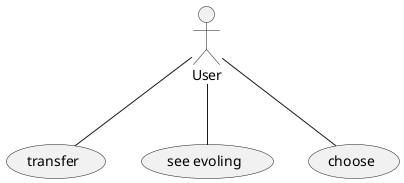
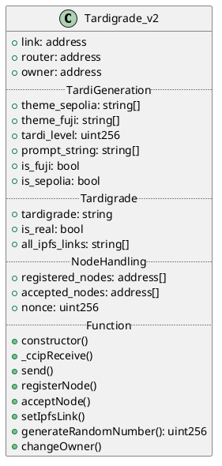
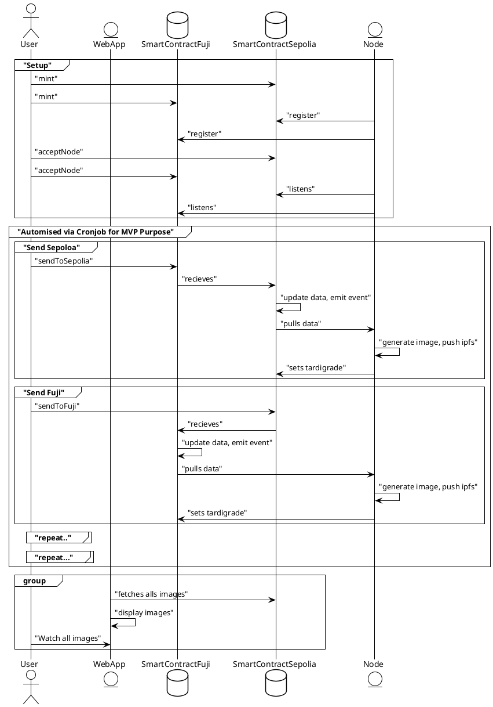

# Software Design 2

> ⚠️ We changed the inital Design.
> We adjusted the document [here](https://hackmd.io/@uv8lNHtfS3Kc0nK3GAWRnw/ByHk_aQIa)
> This a is a copy.

## Idea

`tardigrade.surge.sh`

### Problem

- NFT are not crosschainable. They die.

### Solution

- Add CCIP to a digital asset (NFT)
- Use simplistic ai to show livelyness

## Requirments

### Functional Requirments

- A NFT should be transferable from Chain A to Chain B
- A NFT should be transferable from Chain B to Chain A
- A NFT should be able to evolve

### Non Function Requirments

- Keep it simple

## Story

### User Story

- As a User I want to be able to transfer my NFT
- As a User I want to be able to see my NFT evolving 
- As a User I want to decided who does the evolving

## Diagrams

### Use Case

### ClassDiagram

### Sequence

