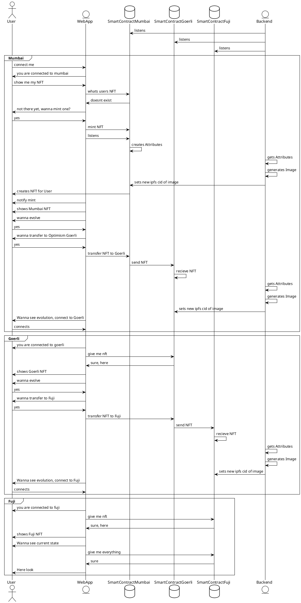

# Tardigrade

resilent multchain dynamic NFT

  
    Max, Rayn and Frank
  

---
layout: intro-image-right
image: 'https://gitlab.com/constellation-hackathon-2023/frontend/scaffold-eth-2/-/raw/main/packages/docs/public/taris-logo.png'
---

## Problem

- 🥹 Nfts dont survive cross chain

## Solution

- 🥳 Give them some resilence

---
layout: image-left
image: 'https://gitlab.com/constellation-hackathon-2023/frontend/scaffold-eth-2/-/raw/main/packages/docs/public/taris-logo.png'
---

<h1>How?</h1>

<code>UML</code>

---

# Demo

[Live](https://tardigrade.surge.sh)

<iframe width="560" height="315" src="https://www.youtube.com/embed/dQw4w9WgXcQ?si=oDVCtI6tJ6ySs1S7" title="YouTube video player" frameborder="0" allow="accelerometer; autoplay; clipboard-write; encrypted-media; gyroscope; picture-in-picture; web-share" allowfullscreen></iframe>

---
layout: intro-image-right
image: 'https://gitlab.com/constellation-hackathon-2023/frontend/scaffold-eth-2/-/raw/main/packages/docs/public/taris-logo.png'
---

## Maximilian Stahl

- 🧗 SmartContract Engineer
- :zap: does small sized audits on Ethereum
- 🌤️wants ai chain skillies, high demand 

## Rayn Stark
- 🕸️DevOps Node Operator
- 🌤️does clustering
- 💡 want cross chain network setup skillies

## Frank Dierolf

- 🧑‍🏭 Software Engineer  
- 🐉 does holograms on chain on Polkadot
- 🛠️wants more cross chain skillies

---
layout: fact
---

# Thank you
