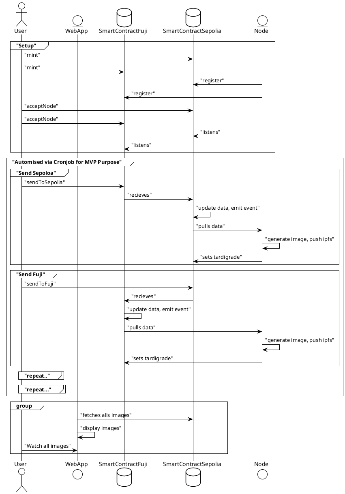

# Tardigrade

Resilent multchain dynamic NFT

  
    Max, Christopher and Frank
  

---
---

## Why

- 😭 NFT's doesn't survive a cross chain Transfer

## Solution
- 🦾 Tardigrade, the most resilent NFT
- 🌱 Tardigrades don't die, they evolve via cross chain
- 🖱️Tardigrade choose their Evolver

## Technologies
- ⚙️ OpenAI SDK + Chainlink CCIP
- ⚒️ Hardhat for deployment & verification
- 🖼️Frontend React

`Inpspriation: video games, pokemon, cryptoi ktties, ...`
---

# Demo

[Live](https://tardigrade.surge.sh)
<iframe width="560" height="315" src="https://www.youtube.com/embed/LUEmOLQZ-l8?si=NdTlqfg6O6OhL0DQ" title="YouTube video player" frameborder="0" allow="accelerometer; autoplay; clipboard-write; encrypted-media; gyroscope; picture-in-picture; web-share" allowfullscreen></iframe>

---
layout: intro-image-right
image: 'https://i.ibb.co/c8Lp1Sj/carbon-7.png'
---

### How ?

---
layout: intro-image-right
image: 'https://gitlab.com/constellation-hackathon-2023/frontend/scaffold-eth-2/-/raw/main/packages/docs/public/taris-logo.png'
---
### Maximilian Stahl

- 🧗 Fullstack Engineer
- 🧠 knows every news in crypto
- 🔥 wants more hot things

### Christopher Glissner

- 🕸️Fullstack Engineer 
- 😵‍💫 does too much chainlink thingies 
- 💡 want improve chainlink knowledge

### Frank Dierolf

- 🧑‍🏭 Software Engineer  
- 🐉 does holograms on chain on Polkadot
- 🛠️wants more cross chain skillies

---
layout: fact
---

# Thank you
